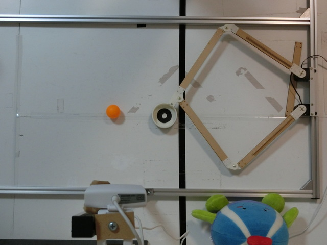
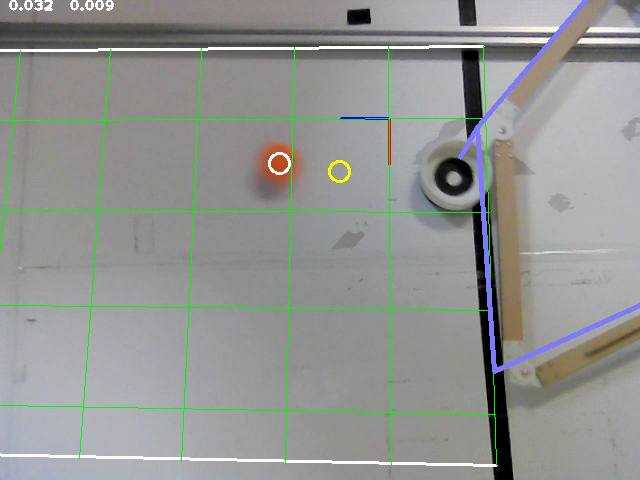

# table-hockey
A table hockey robot using parallel link mechanism and vision sensor

See https://yamaguchi-am.blogspot.com/2021/12/blog-post.html for details.

## Hardware Setup
- KONDO DUAL USB adapter
  - 2 KRS servos (ID: 0 and 1, baud: 1.25M)
- USB camera

## Build

    git submodule update --init
    mkdir build
    cd bulid
    cmake ..
    make

## Camera and Mechanism Calibration
1. Use [yamaguchi-am/opencv_calibration](https://github.com/yamaguchi-am/opencv_calibration) to generate camera parameter XML file from images.
  - The unit should be given in millimeters.
  - The coordinate system (decided by the 1st image) should be aligned to the field. See the blog for details.

2. Start this program, place a checker board pattern, and hit [F] to capture camera position.
  - This step may be omitted if the coordinate system is already aligned by step 1.

3. Collect hand-eye calibration datapoints by [a] key, (Optionally, save it by [S])

4. Enter "O (Optimize)" command and see if the blue line fits to the mechanism in the image. Note that each link line may no always exactly align with the real links of the mechanism, even when the end effector position is aligned.

5. Configure field size.
  - Place the ball to the left edge of the field and enter [1] command.
  - Place the ball to the right edge of the field and enter [2] command.

6. Save the configuration by [W] command.

When the camera is relocated, go back to step 2.

When the camera is replaced, go back to step 1.

## Key bindings

- a: add hand-eye calibration data point.
- F: capture camera position; fit the world coordinate system to a chess board pattern.
- S: save hand-eye calibration data points to file (calib_points.txt). Deprecated. Use [W] to save arm parameters after optimization instead.
- L: load hand-eye calibration data points from file. Deprecated.
- W: save configuration (camera position, arm parameters, field borders) to file.
- R: load configuration from file.
- O: optimize hand-eye parameters using the data points.
- g: toggle ON/OFF arm motion
- 1: set field left (Y+) limit to the current ball position
- 2: set field right (Y-) limit to the current ball position
